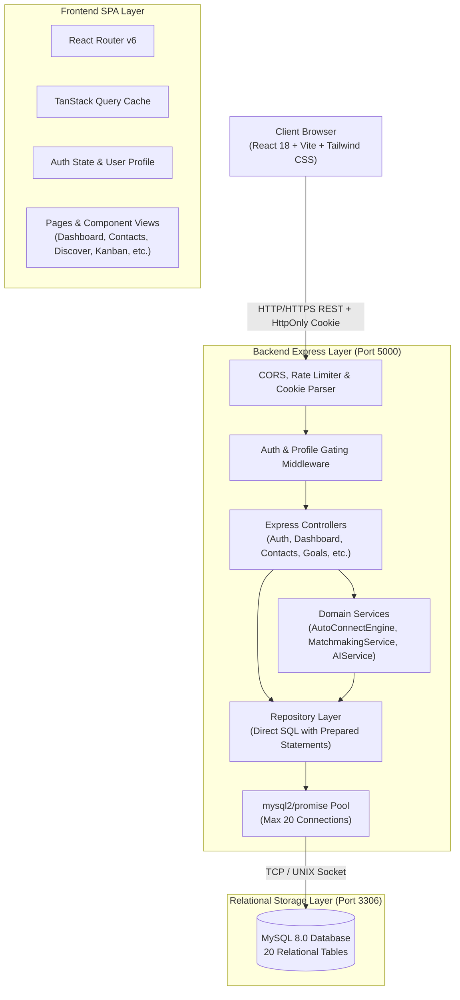
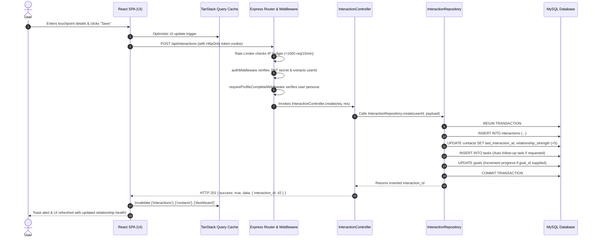

# System Architecture & End-to-End Data Flow

## 1. Executive Summary

**NexaLink CRM** is an AI-powered personal networking and relationship intelligence system. It combines personal CRM capabilities (contacts, meetings, tasks, notes, interactions) with automated matchmaking, warm introduction discovery, and AI messaging coaches.

The system is architected as a **SQL-First, Micro-Modular Monolith**:
- **Frontend:** Single Page Application (SPA) built with React 18, Vite, TypeScript, Tailwind CSS, TanStack Query, and Lucide React.
- **Backend:** Node.js Express REST API in TypeScript, strictly SQL-First (prepared statements via `mysql2/promise`, no ORM).
- **Database:** Normalized MySQL 8.0+ / MariaDB 10.4+ relational database on port 3306.
- **AI Intelligence Boundary:** Modularized AI Service orchestrating prompts, persona-guided message drafts, meeting summaries, and proactive relationship insights.

---

## 2. Global Architecture Diagram



---

## 3. End-to-End Request-Response Lifecycle

Here is the exact lifecycle of a typical authenticated request (for example, logging an interaction with a contact):



---

## 4. Key Subsystem Boundaries

### A. The Client SPA (`frontend/src/`)
- Built using Vite for instant HMR.
- Uses TanStack Query for declarative server-state management, automated background refetching, and cache invalidation.
- Zero complex global Redux boilerplate; identity and authentication are scoped cleanly to `AuthContext.tsx`.

### B. The REST API Engine (`backend/src/`)
- Pure Express runtime running on port 5000 (configurable via `.env`).
- Standardized response helpers (`sendSuccess`, `sendError`) guaranteeing uniform JSON envelopes:
  ```json
  {
    "success": true,
    "data": { ... }
  }
  ```
- Errors bubble to a unified `errorHandler.ts` middleware preventing process crashes and stack trace leaks.

### C. The Relational Core (`backend/src/database/`)
- Strictly relational with foreign keys and cascade rules.
- Fully normalized to 3rd Normal Form (3NF) while leveraging MySQL native JSON columns for dynamic taxonomies (`skills`, `interests`, `targetBusinesses`).

---

## 5. Security & Isolation Controls

1. **Token Storage:** JWT tokens are stored exclusively inside `HttpOnly`, `SameSite=Lax` cookies, neutralizing XSS credential theft.
2. **User Data Isolation:** Every database query explicitly mandates `WHERE user_id = ?`. Cross-tenant data leakage is fundamentally impossible.
3. **Transaction Safety:** Multi-table write workflows run inside `withTransaction()`, providing guaranteed `ROLLBACK` on database errors.
4. **Rate Limiting:** Protects against automated spam or DDoS via IP-bucket limits.
