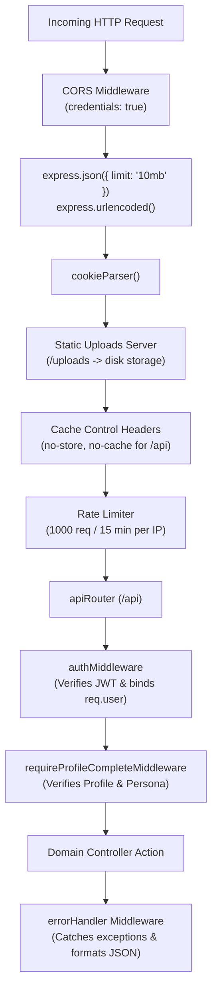

# Backend Architecture & Code Logic Deep Dive

## 1. Architectural Philosophy: SQL-First Monolith

The backend of NexaLink CRM is architectured on a **SQL-First** foundation without ORMs (Object-Relational Mappers). 

### Why No ORM?
1. **Predictable Query Performance:** No hidden `N+1` query cascades or mysterious join generation.
2. **Deterministic Index Usage:** Complex multi-table filters in search and dashboard use hand-tuned queries utilizing MySQL compound indexes.
3. **Prepared Statements Security:** Every parameterized argument is automatically escaped by MySQL driver binary protocol.
4. **Lightweight Runtime:** Node.js process starts in $< 300\text{ ms}$ with low memory consumption.

---

## 2. Directory & Layer Organization

```text
backend/src/
├── config/             # Environment variables, DB pool, and Goal taxonomies
├── controllers/        # HTTP controllers (parse request, validate, invoke domain layer)
├── database/           # schema.sql, migrations runner, and database seeders
├── helpers/            # Standardized JSON response envelope handlers
├── jobs/               # Background cron jobs (daily matchmaking sync)
├── middleware/         # Auth, profile completeness, audit logs, error handling
├── repositories/       # Direct SQL repository classes executing prepared statements
├── routes/             # Express API routing tree
├── services/           # Pure algorithmic services (AutoConnectEngine, AIService)
└── server.ts           # Server bootstrap, CORS, static uploads, error middleware
```

---

## 3. Express Pipeline & Middleware Stack

Requests pass through an orderly middleware pipeline in `server.ts`:



---

## 4. Middleware Deep Dive

### A. Authentication Middleware (`middleware/auth.ts`)
Validates user identity from the HttpOnly cookie or Authorization Bearer header:
```typescript
export function authMiddleware(req: Request, res: Response, next: NextFunction) {
  const token = req.cookies?.token || req.headers.authorization?.replace('Bearer ', '');

  if (!token) {
    return sendError(res, 'Authentication required', 401, 'UNAUTHORIZED');
  }

  try {
    const decoded = jwt.verify(token, config.jwtSecret) as { userId: number; email: string };
    req.user = decoded;
    next();
  } catch (err) {
    return sendError(res, 'Invalid or expired session token', 401, 'INVALID_TOKEN');
  }
}
```

### B. Profile Completeness Gating (`middleware/requireProfile.ts`)
Ensures high networking data quality. Users with incomplete profiles cannot access CRM features until onboarding is complete:
```typescript
export async function requireProfileCompleteMiddleware(req: Request, res: Response, next: NextFunction) {
  const userId = req.user?.userId;
  if (!userId) return sendError(res, 'Authentication required', 401);

  const profile = await ProfileRepository.getProfileByUserId(userId);
  const persona = await ProfileRepository.getPersonaByUserId(userId);

  if (!profile || !persona) {
    return sendError(res, 'Profile and persona must be completed before accessing this feature', 403, 'PROFILE_INCOMPLETE');
  }

  next();
}
```

### C. Audit Logging Middleware (`middleware/audit.ts`)
Records operational history for enterprise accountability:
```typescript
export async function logAudit(
  req: Request,
  action: string,
  resourceType: string,
  resourceId?: number | string,
  metadata?: any
) {
  try {
    const userId = req.user?.userId || null;
    const ipAddress = req.ip || req.socket.remoteAddress || 'unknown';
    await query(
      `INSERT INTO audit_logs (user_id, action, resource_type, resource_id, metadata, ip_address)
       VALUES (?, ?, ?, ?, ?, ?)`,
      [userId, action, resourceType, resourceId ? String(resourceId) : null, metadata ? JSON.stringify(metadata) : null, ipAddress]
    );
  } catch (err) {
    console.error('Audit log failure:', err);
  }
}
```

---

## 5. Repository Pattern & Raw SQL Execution

All data operations are encapsulated inside static repository classes. Repositories accept raw primitive arguments (`userId: number, filters: object`) and return typed arrays or records.

### Sample Pattern: Filter-Driven Dynamic SQL Generation
```typescript
// backend/src/repositories/TaskRepository.ts
static async list(userId: number, filters: { status?: string; priority?: string; contact_id?: number } = {}) {
  const whereClauses: string[] = ['t.user_id = ?'];
  const params: any[] = [userId];

  if (filters.status && filters.status !== 'all') {
    whereClauses.push('t.status = ?');
    params.push(filters.status);
  }

  if (filters.priority && filters.priority !== 'all') {
    whereClauses.push('t.priority = ?');
    params.push(filters.priority);
  }

  if (filters.contact_id) {
    whereClauses.push('t.contact_id = ?');
    params.push(filters.contact_id);
  }

  const sql = `
    SELECT t.*, CONCAT(c.first_name, ' ', c.last_name) as contact_name
    FROM tasks t
    LEFT JOIN contacts c ON t.contact_id = c.contact_id
    WHERE ${whereClauses.join(' AND ')}
    ORDER BY t.due_date ASC
  `;

  return await query<TaskRow[]>(sql, params);
}
```

---

## 6. Global Error Handling Strategy

Errors in asynchronous Express controller routes are passed to `next(err)`. The `errorHandler.ts` middleware intercepts all uncaught errors, standardizes the payload, and hides stack traces in production:

```typescript
export function errorHandler(err: any, req: Request, res: Response, _next: NextFunction) {
  const statusCode = err.statusCode || err.status || 500;
  const message = err.message || 'Internal server error';
  const code = err.code || 'INTERNAL_ERROR';

  console.error(`[Error] ${req.method} ${req.url}:`, err);

  return res.status(statusCode).json({
    success: false,
    error: {
      code,
      message,
      ...(process.env.NODE_ENV !== 'production' && { stack: err.stack }),
    },
  });
}
```
