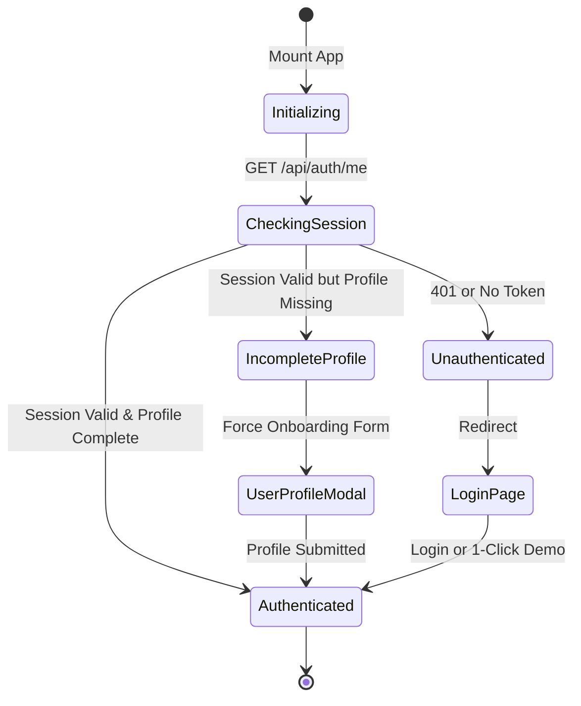

# Frontend Architecture & UI Logic Deep Dive

## 1. Frontend Architecture Overview

The frontend of NexaLink CRM is built as a responsive Single Page Application (SPA) prioritizing mobile ergonomics, instantaneous screen transitions, and optimistic state updates.

### Core Technology Stack
- **Framework & Runtime:** React 18 with TypeScript.
- **Build Tool:** Vite with fast Hot Module Replacement (HMR).
- **Styling Engine:** Tailwind CSS with custom border-radius curves (`rounded-3xl`) and soft shadows (`shadow-card`, `shadow-soft`).
- **Server-State Management:** TanStack Query (React Query v5).
- **Navigation:** React Router v6 with authenticated route guarding.
- **Icons:** Lucide React.
- **Data Visualizations:** Recharts.
- **Micro-Delight Animations:** Canvas Confetti.

---

## 2. Directory Hierarchy

```text
frontend/src/
├── app/
│   └── router.tsx             # Route definitions & AuthGuard wrappers
├── components/
│   ├── auth/                  # Google OAuth and credential helpers
│   ├── layout/                # AppLayout, Navbar, Sidebar, BottomNav
│   └── ui/                    # Modals (QuickAdd, WarmIntro, CanConnectDrawer, etc.)
├── context/
│   └── AuthContext.tsx        # Authentication machine, user state & demo dispatcher
├── lib/
│   ├── api.ts                 # Axios/Fetch API client wrapper with credential handling
│   ├── matchmakingEngine.ts   # Client-side matchmaking & synergy vector calculators
│   └── utils.ts               # Date formatters, initials extractor, classnames
├── pages/                     # Full page route components (Dashboard, Contacts, Kanban...)
└── types/                     # TypeScript shared domain contracts
```

---

## 3. Server-State Management with TanStack Query

Instead of synchronizing database models into heavyweight client stores, NexaLink leverages TanStack Query as the single source of truth for remote state.

### A. Declarative Data Fetching Pattern
```tsx
const { data, isLoading, isError, refetch } = useQuery({
  queryKey: ['contacts', filters],
  queryFn: () => api.getContacts(filters),
  staleTime: 1000 * 60 * 5, // Data fresh for 5 minutes
});
```

### B. Coordinated Cache Invalidation Pattern
When a user updates data, relevant queries are invalidated to force an automatic background sync:
```tsx
const queryClient = useQueryClient();

const createInteractionMutation = useMutation({
  mutationFn: (newInteraction) => api.createInteraction(newInteraction),
  onSuccess: () => {
    // Invalidate dependent queries across the application
    queryClient.invalidateQueries({ queryKey: ['interactions'] });
    queryClient.invalidateQueries({ queryKey: ['contacts'] });
    queryClient.invalidateQueries({ queryKey: ['dashboard'] });
    queryClient.invalidateQueries({ queryKey: ['tasks'] });
    queryClient.invalidateQueries({ queryKey: ['goals'] });
  },
});
```

---

## 4. Authentication State Machine (`context/AuthContext.tsx`)

The authentication lifecycle handles initial token checks, onboarding completeness verification, and demo logins:



---

## 5. Mobile-First Responsive Design System

The application strictly enforces a **Mobile-First** paradigm:

| Screen Width | Viewport Device | UI Adaptation Strategy |
|---|---|---|
| **$360\text{px} - 639\text{px}$** | Mobile Phones | Sidebar is hidden; sticky `BottomNav` is activated; tables collapse to cards; 1-2 column layouts. |
| **$640\text{px} - 1023\text{px}$** | Tablets | 2-column card layouts; bottom sheet modals; collapsible navigation. |
| **$\ge 1024\text{px}$** | Laptops / Desktops | Persistent desktop sidebar (`w-64`); 4-column KPI cards; rich data tables and multi-column Kanban board. |

### Layout Shell (`components/layout/AppLayout.tsx`)
```tsx
<div className="min-h-screen bg-slate-50 flex flex-col lg:flex-row">
  {/* Desktop Sidebar (hidden on mobile) */}
  <Sidebar className="hidden lg:flex" />

  <div className="flex-1 flex flex-col min-w-0">
    {/* Global Top Navbar */}
    <Navbar onOpenQuickAdd={() => setShowQuickAdd(true)} />

    {/* Primary Page Content */}
    <main className="flex-1 pb-20 lg:pb-10 p-4 sm:p-6 lg:p-8 max-w-7xl mx-auto w-full">
      <Outlet />
    </main>

    {/* Mobile Sticky Bottom Nav (hidden on desktop) */}
    <BottomNav className="lg:hidden" />
  </div>
</div>
```
