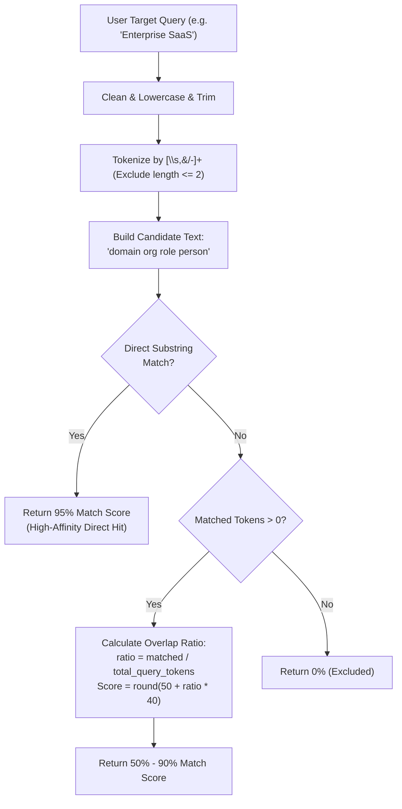

# Matchmaking & AutoConnect Algorithms Deep Dive

## 1. Overview & Theoretical Foundation

Networking platforms suffer from cold-start fatigue: users do not know whom to reach out to or how to approach them. 
NexaLink CRM solves this through **Bidirectional Compatibility Algorithms** that pair direct need queries with warm 2nd-degree introductory bridges.

The matchmaking engine comprises two distinct algorithmic components:
1. **The AutoConnect Engine:** Real-time tokenized query matching against network bridge candidates.
2. **The 100-Point Matchmaking Service:** Multi-vector ecosystem compatibility scoring with objective taxonomy complementarity.

---

## 2. AutoConnect Engine: Tokenization & Two-Tier Scoring

The function `calculateMatchScore(query, domain, org, role, person)` executes a two-tier evaluation:



### Mathematical Formulation of Token Overlap
Let $T_Q = \{t_1, t_2, \dots, t_n\}$ be the set of normalized tokens from user query $Q$ such that $|t_i| > 2$.
Let $C = \{c_1, c_2, \dots, c_m\}$ be the normalized tokens of candidate bridge $B$.

$$\text{Matched}(T_Q, C) = |\{t \in T_Q \mid t \text{ is a substring of } C\}|$$
$$\text{Ratio} = \frac{\text{Matched}(T_Q, C)}{\max(|T_Q|, 1)}$$
$$\text{Score} = \min\left(90, \max\left(50, \operatorname{round}\left(50 + 40 \times \text{Ratio}\right)\right)\right)$$

---

## 3. Multi-Vector Synergy Engine

Beyond scalar match scores, `calculateSynergyVector` assesses 4 distinct dimensions:

$$\mathbf{S} = \begin{bmatrix} S_{\text{domain}} \\ S_{\text{goal}} \\ S_{\text{bridge}} \\ S_{\text{geo}} \end{bmatrix}$$

1. **Domain Synergy ($S_{\text{domain}}$):** Scaled base match score ($50\% - 100\%$).
2. **Goal Synergy ($S_{\text{goal}}$):** Strategic keyword alignment (Partnerships, Funding, Hiring, Mentorship). Yields $90\%$ if keywords overlap, otherwise $70\%$.
3. **Bridge Quality ($S_{\text{bridge}}$):** 
   - Named 1st-degree human bridge with established relationship: $95\%$.
   - Named contact without verified relationship: $80\%$.
   - Generic company contact: $60\%$.
4. **Geographic Proximity ($S_{\text{geo}}$):**
   - Exact city match: $100\%$.
   - Candidate city matches user's target city: $85\%$.
   - Different geographic regions: $60\%$.

$$\text{Overall Fit} = \operatorname{round}\left(0.40 \cdot S_{\text{domain}} + 0.30 \cdot S_{\text{goal}} + 0.20 \cdot S_{\text{bridge}} + 0.10 \cdot S_{\text{geo}}\right)$$

---

## 4. The 100-Point Matchmaking Service

`MatchmakingService.calculateMatchScore(userA, userB)` synthesizes 7 orthogonal dimensions:

```text
+-----------------------------------------------------------------------+
| Category                        Max Points    Calculation Strategy    |
+-----------------------------------------------------------------------+
| Shared Networking Groups        30 pts        Intersection count >= 2 |
| Cross-Category Interests        25 pts        12 pts per overlap      |
| Services & Domain Synergy       20 pts        N-Gram token match in bio|
| Intent Complementarity          20 pts        GoalTaxonomy mapping    |
| Geographic Alignment            15 pts        City vs Target cities   |
| Offered Network Bridges         15 pts        Bridge vs Target domain |
| Profile Completeness            5 pts         Bio/Photo/Headline checks|
+-----------------------------------------------------------------------+
| TOTAL SCORE CAPPED AT 98 PTS (Baseline fallback: 40 pts)              |
+-----------------------------------------------------------------------+
```

### Intent Complementarity Table (Taxonomy Rules)
| When User A Seeks... | Complement Rule Matches When User B Has... |
|---|---|
| **Find Investors** | Job keywords (`angel`, `vc`, `partner`, `capital`) or bridge in `Venture Capital`. |
| **Find Co-Founder** | Job keywords (`cto`, `architect`, `engineer`) or bridge in `DeepTech`, `AI`. |
| **Hire Talent** | Job keywords (`recruiter`, `headhunter`, `talent`) or bridge in `HR`, `Staffing`. |
| **Find Clients** | Job keywords (`procurement`, `cxo`, `buyer`, `director`) or bridge in `Enterprise SaaS`. |

---

## 5. Bidirectional Reverse Matching

A pairing is labeled `isReverseMatch = true` when reciprocity is proven:
$$\exists \text{ Need}_A \cap \text{ Bridge}_B \neq \emptyset \quad \land \quad \exists \text{ Need}_B \cap \text{ Bridge}_A \neq \emptyset$$

When this condition is satisfied, the connection recommendation is marked with a distinctive purple badge and automatically prioritizes mutual introduction prompts.
