# Database Schema & SQL Query Logic Deep Dive

## 1. Relational Database Overview

The persistence layer is implemented in **MySQL 8.0+ / MariaDB 10.4+** with InnoDB storage engine, `utf8mb4` encoding, and `utf8mb4_unicode_ci` collation. 

### Key Characteristics:
- **No ORM:** Queries are written directly in raw SQL using prepared statements.
- **Foreign Key Cascades:** Referential integrity with automated cleanup (`ON DELETE CASCADE` or `ON DELETE SET NULL`).
- **Hybrid Relational + JSON:** Core entities (contacts, interactions, tasks) are fully normalized; semi-structured user attributes (`skills`, `interests`, `networking_goals`) use MySQL native `JSON` columns.

---

## 2. Entity-Relationship (ER) Diagram

```mermaid
erDiagram
    users ||--o| user_profiles : "1-to-1 profile"
    users ||--o| user_personas : "1-to-1 persona"
    users ||--o{ oauth_accounts : "OAuth providers"
    users ||--o{ contacts : "owns contacts"
    users ||--o{ tags : "owns custom tags"
    users ||--o{ goals : "sets goals"
    users ||--o{ tasks : "manages tasks"
    users ||--o{ notes : "writes notes"
    users ||--o{ meetings : "schedules meetings"
    users ||--o{ interactions : "logs touchpoints"
    users ||--o{ posts : "publishes feed posts"
    users ||--o{ notifications : "receives alerts"
    users ||--o{ audit_logs : "records audit trail"

    contacts ||--o{ contact_tags : "tagged with"
    tags ||--o{ contact_tags : "linked to"

    contacts ||--o{ interactions : "participates in"
    contacts ||--o{ meetings : "attends"
    contacts ||--o{ tasks : "associated with"
    contacts ||--o{ notes : "referenced in"

    goals ||--o{ goal_progress : "tracks milestones"
    goals ||--o{ tasks : "advances goal"
    goals ||--o{ interactions : "advances goal"

    posts ||--o{ feed_likes : "receives likes"
    posts ||--o{ post_replies : "threaded replies"

    users ||--o{ user_recommendations : "receives recommendations"
    users ||--o{ user_match_scores : "match cache"
```

---

## 3. Complete Data Dictionary (20 Tables)

### 1. `users`
Core authentication account record.
- `user_id` (BIGINT UNSIGNED, PK, AUTO_INCREMENT)
- `email` (VARCHAR(255), UNIQUE, NOT NULL)
- `password_hash` (VARCHAR(255), NULL for OAuth)
- `display_name` (VARCHAR(150), NOT NULL)
- `avatar_url` (LONGTEXT, NULL)
- `status` (ENUM('active','inactive','blocked'), DEFAULT 'active')
- `created_at`, `updated_at` (DATETIME)

### 2. `user_profiles`
Professional biography and identity settings.
- `profile_id` (BIGINT UNSIGNED, PK, AUTO_INCREMENT)
- `user_id` (BIGINT UNSIGNED, UNIQUE, FK -> users.user_id)
- `headline`, `company`, `job_title`, `location`, `industry`, `website`, `linkedin_url` (VARCHAR)
- `bio` (TEXT)
- `skills`, `interests`, `networking_goals` (JSON)

### 3. `user_personas`
AI networking voice, target audiences, and communication instructions.
- `persona_id` (BIGINT UNSIGNED, PK, AUTO_INCREMENT)
- `user_id` (BIGINT UNSIGNED, FK -> users.user_id)
- `persona_name` (VARCHAR(100), DEFAULT 'Default Persona')
- `communication_style` (VARCHAR(100), DEFAULT 'Concise & Strategic')
- `preferred_people` (TEXT)
- `networking_goal` (TEXT)

### 4. `contacts`
The CRM address book and relationship health state.
- `contact_id` (BIGINT UNSIGNED, PK, AUTO_INCREMENT)
- `user_id` (BIGINT UNSIGNED, FK -> users.user_id)
- `first_name`, `last_name` (VARCHAR(100), NOT NULL)
- `email`, `phone`, `company`, `job_title`, `location`, `website`, `linkedin_url`, `avatar_url` (VARCHAR)
- `relationship_type` (ENUM: friend, mentor, mentee, colleague, client, prospect, founder, investor, recruiter, partner, other)
- `relationship_strength` (INT, DEFAULT 50, Range: 0–100)
- `last_interaction_at` (DATETIME, NULL)
- `next_follow_up_at` (DATETIME, NULL)
- `notes` (TEXT)
- **Indexes:** `idx_contacts_user`, `idx_contacts_followup (user_id, next_follow_up_at)`, `idx_contacts_strength (user_id, relationship_strength)`

### 5. `tags` & 6. `contact_tags`
Tagging taxonomy and many-to-many relationship mapping.
- `tags`: `tag_id`, `user_id`, `name`, `color`, UNIQUE KEY `(user_id, name)`
- `contact_tags`: `contact_id`, `tag_id`, PK `(contact_id, tag_id)`

### 7. `interactions`
Granular historical touchpoint log.
- `interaction_id` (BIGINT UNSIGNED, PK, AUTO_INCREMENT)
- `user_id` (BIGINT UNSIGNED, FK -> users.user_id)
- `contact_id` (BIGINT UNSIGNED, FK -> contacts.contact_id)
- `goal_id` (BIGINT UNSIGNED, NULL, FK -> goals.goal_id)
- `interaction_type` (ENUM: meeting, call, email, message, coffee, event, introduction, note, other)
- `title` (VARCHAR(200), NOT NULL)
- `interaction_date` (DATETIME, NOT NULL)
- `duration_minutes` (INT, DEFAULT 30)
- `summary`, `outcome` (TEXT)
- `follow_up_required` (TINYINT(1), DEFAULT 0)
- `follow_up_date` (DATETIME, NULL)
- `sentiment` (ENUM('positive','neutral','negative'), DEFAULT 'positive')

### 8. `meetings`
Scheduled future discussions and calendar events.
- `meeting_id` (BIGINT UNSIGNED, PK, AUTO_INCREMENT)
- `user_id`, `contact_id` (FKs)
- `title`, `meeting_type`, `start_at`, `end_at`, `location`, `agenda`, `outcome`, `status`

### 9. `goals` & 10. `goal_progress`
Networking milestones and velocity logs.
- `goals`: `goal_id`, `user_id`, `title`, `goal_type`, `target_value`, `current_value`, `unit`, `start_date`, `end_date`, `status`
- `goal_progress`: `progress_id`, `goal_id`, `progress_date`, `progress_value`, `notes`

### 11. `tasks`
Actionable to-dos across the Kanban stages (`todo`, `in_progress`, `done`).
- `task_id`, `user_id`, `contact_id`, `goal_id`, `title`, `description`, `status`, `priority`, `due_date`, `completed_at`

### 12. `notes`
Rich memos and qualitative context.
- `note_id`, `user_id`, `contact_id`, `title`, `content`, `is_pinned` (TINYINT)

### 13. `user_recommendations` & 14. `user_match_scores`
Precomputed matchmaking cache and candidate status.
- `user_recommendations`: `recommendation_id`, `user_id`, `recommended_user_id`, `score`, `reason`, `status`
- `user_match_scores`: `user_id`, `target_user_id`, `score`, `reasons` (JSON)

### 15. `posts`, 16. `feed_likes` & 17. `post_replies`
Social networking feed, like tracking, and threaded comments.

### 18. `notifications`
Alerts for follow-ups, meetings, and system notifications.

### 19. `oauth_accounts`
Google/Microsoft OAuth credentials linked to user accounts.

### 20. `audit_logs`
System security and action trail records.

---

## 4. Compound Indexing Strategies

| Table | Index Columns | Query Optimization Target |
|---|---|---|
| `contacts` | `(user_id, next_follow_up_at)` | Follow-ups Due KPI counter and calendar due query |
| `contacts` | `(user_id, relationship_strength)` | Sort contacts by strongest bonds |
| `tasks` | `(user_id, status, due_date)` | Dashboard "Today's Action Items" |
| `meetings` | `(user_id, start_at)` | Upcoming meetings query |
| `interactions`| `(user_id, interaction_date)` | Recent touchpoints feed |
| `notifications`| `(user_id, is_read, created_at)` | Unread notifications badge counter |
